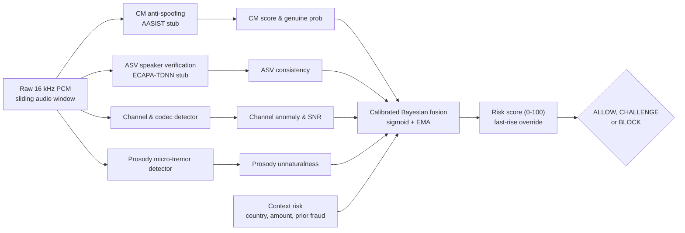

# VaniRakshak

**Target-Conditioned Recorded-Audio Forensic System** — real-time detection of voice-cloning and deepfake-audio fraud on live calls, with an autonomous transaction interlock.

VaniRakshak listens to a live audio stream, scores it for synthetic/manipulated speech, and drives a risk decision (`ALLOW` → `CHALLENGE` → `BLOCK`) that can lock a transaction mid-call and fire alerts.

## How it works

The dashboard streams microphone audio to a forensic backend over WebSocket and renders the verdict in real time.

```
Microphone  →  16-bit PCM @ 16 kHz  →  WebSocket /ws/stream  →  Forensic backend
                                                                      │
                                                                      ▼
                                                     risk_score, spoof_score,
                                                     speaker_similarity, snr_db
                                                                      │
                                                                      ▼
                                                    ALLOW / CHALLENGE / BLOCK
```



> **Architecture Diagrams:** Detailed interactive flowcharts are available in [docs/FLOWCHARTS_CORRECTED.md](docs/FLOWCHARTS_CORRECTED.md) and viewable in your browser at [docs/flowcharts.html](docs/flowcharts.html).

| Risk score | Label | Action |
|---|---|---|
| `< 35` | LOW RISK | `ALLOW` — transaction proceeds |
| `35 – 69` | SUSPICIOUS | `CHALLENGE` — caller must repeat a dynamic phrase |
| `>= 70` | CRITICAL | `BLOCK` — transaction interlock engages, alerts fire |

`BLOCK` or `risk >= 70` hard-locks the transaction control (`transactionLocked`), disabling the proceed button until the stream clears.

### The four detection stages

The landing experience is a scroll-driven canvas animation (220 pre-rendered frames) walking through the pipeline:

1. **Ingestion** — edge-first capture, 16-bit PCM, sub-12 ms latency
2. **Multi-tier analysis** — STFT and bi-spectral inspection for vocoder phase discontinuities and neural speech footprints (AASIST / LFCC)
3. **Biometric defense** — acoustic spoof detection and speaker-verification similarity scoring
4. **Autonomous action** — real-time interlock and quarantine of the transaction

## Project structure

```
.
├── package.json          # workspace wrapper — delegates to frontend/
├── docs/PROTOCOL.md      # frontend <-> backend WebSocket contract (read this first)
├── frontend/             # Next.js 16 (App Router) dashboard
│   ├── public/worklets/pcm-capture.js   # AudioWorklet PCM capture
│   └── app/
│       ├── page.tsx                     # console: live stream, risk meter, event log
│       ├── layout.tsx
│       ├── globals.css
│       └── components/
│           ├── ScrollyVideoCanvas.tsx   # scroll-driven animated pipeline explainer
│           └── ...                      # placeholder stubs (not yet implemented)
└── vanirakshak-backend/  # Python FastAPI forensic service
    └── vanirakshak/
        ├── server/app.py       # REST + WebSocket endpoints
        ├── session.py          # per-call state, interlock, challenges
        ├── risk/fusion.py      # calibrated Bayesian risk fusion
        ├── detectors/          # asv, channel, cm (spoof), prosody, pipeline
        ├── challenge/engine.py # dynamic phrase generation + grading
        ├── alerts/             # server-side alert dispatch (webhook)
        ├── privacy/            # DPDP-style audit log
        └── tests/test_stream_e2e.py  # protocol conformance test
```

The wire format between the two halves is documented in **[docs/PROTOCOL.md](docs/PROTOCOL.md)**.

## Getting started

Run the backend and the dashboard in two terminals.

**Backend** (port 8000):

```bash
cd vanirakshak-backend
pip install -r requirements.txt
python run.py
```

**Dashboard** (port 3001):

```bash
npm install --prefix frontend
npm run dev
```

Open **http://localhost:3001** and click the status badge to start streaming.

With no backend reachable, the UI falls back to **Demo mode**, which cycles three
canned verdicts (risk 18 / 43 / 87) every 4 seconds. Demo results are labelled
`DEMO · SIMULATED` — they are not real detections.

### Configuration

| Variable | Default | Purpose |
|---|---|---|
| `NEXT_PUBLIC_BACKEND_WS` | `ws://localhost:8000/ws/stream` | Dashboard → backend socket |
| `VR_PORT` | `8000` | Backend port |
| `VR_HOST` | `127.0.0.1` | Backend bind host |
| `VR_CORS_ORIGINS` | `http://localhost:3001,http://127.0.0.1:3001` | Allowed browser origins |

### Other scripts

```bash
npm run build   # production build
npm run start   # serve production build
npm run lint    # eslint
```

## Tech stack

- **Next.js 16.3.4** (App Router) · **React 19.2.8**
- **Tailwind CSS v4**
- **lucide-react** iconography
- **TypeScript 5**
- Web Audio API **AudioWorklet** (`public/worklets/pcm-capture.js`) for PCM capture

## Server-side alerting

`vanirakshak/alerts/` dispatches alerts when a call trips `trigger_challenge`
or engages the interlock. It is deliberately **server-side**: delivering from the
browser would require shipping gateway credentials to the client, and a tampered
client could forge or suppress its own alerts.

Set `VR_ALERT_WEBHOOK_URL` to enable it:

```bash
export VR_ALERT_WEBHOOK_URL="https://hooks.example.com/your/webhook"
```

The dispatcher POSTs this JSON body on each qualifying verdict:

```json
{
  "source": "VaniRakshak",
  "session_id": "r5-demo-1699999999999",
  "timestamp_ms": 1699999999999,
  "risk": 87.0,
  "tier": "BLOCK",
  "interlock_active": true,
  "receipt_hash": "9f2c…",
  "challenge_phrase": "Say: Mango 8 nadi 4 blue",
  "message": "VaniRakshak: risk=87.0 tier=BLOCK — transaction blocked"
}
```

Delivery is **best-effort**: when `VR_ALERT_WEBHOOK_URL` is unset the dispatcher
is a no-op, and any HTTP failure is logged and swallowed so an alerting outage
can never break call analysis.

## Reconnect behaviour

If the WebSocket drops, the dashboard retries up to **5 times** with exponential
backoff (1 s → 2 s → 4 s → 8 s → 15 s cap) plus random jitter to avoid
thundering-herd reconnects. After 5 failed attempts it gives up and logs the
failure; clicking the status badge starts a fresh session. Closing the stream
deliberately never triggers a retry.

## Notes

**The detectors are synthetic stubs.** Per the backend README, `vanirakshak-backend`
ships *deterministic synthetic "honest stub" models* so the full pipeline — fusion,
challenge engine, privacy layer, WebSocket streaming — runs on any laptop with no GPU
and no pretrained weights. Real AASIST / ECAPA-TDNN checkpoints can be dropped in later
by replacing two files in `vanirakshak/detectors/`. Scores are therefore **not** yet
real detections.

Status of pipeline components:

- `Makefile` and `docker-compose.yml` are configured for development and containerization.
- Architecture and specification documents are located in `docs/` (`ARCHITECTURE.md`, `PROTOCOL.md`, `API_SPEC.md`, `RUNBOOK.md`, `FLOWCHARTS_CORRECTED.md`).
- Evaluation harness: ASVspoof-5 evaluation harness available via `benchmarks/compute_mindcf.py` (`python -m vanirakshak eval`).
- Reconnection & Alerting: Robust 5-stage backoff reconnect logic in frontend; server-side webhook dispatcher in `vanirakshak/alerts/`.
- Frontend modular components (`AudioUploadZone`, `DemoQuickSelector`, `ForensicVerdictCard`, `WaveformEvidenceTimeline`) are reserved for the file-upload and timeline inspection views.
- The interlock is `interlock_active || action === "BLOCK" || risk >= 70`. The server owns the decision; client-side thresholds exist only for demo mode.

## License

Apache-2.0
