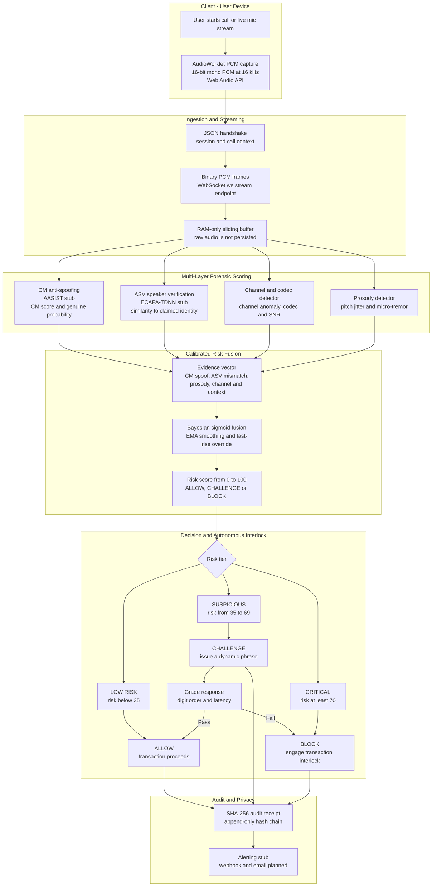
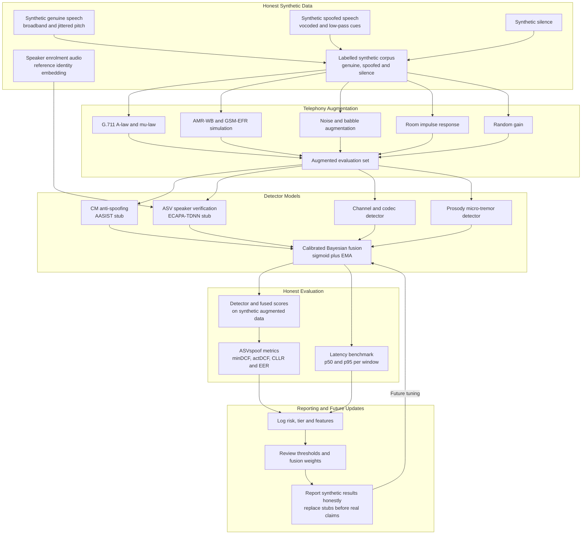
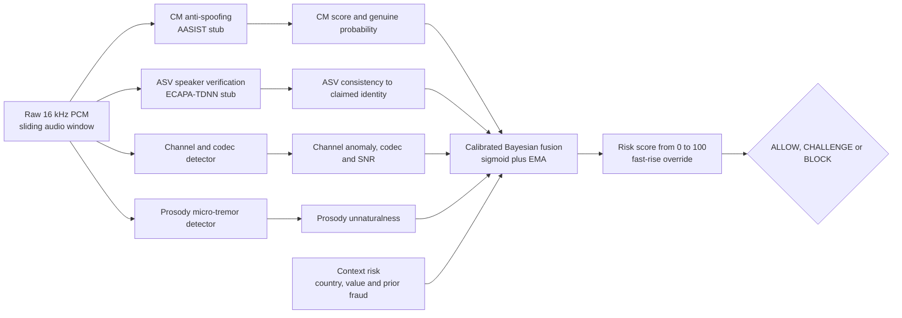

# VaniRakshak - Corrected Architecture Flowcharts

> **If your Markdown viewer fails to render the Mermaid below**, open
> `docs/flowcharts.html` in a browser - it bundles Mermaid and renders both
> diagrams directly. The syntax here was also hardened (no `&` junctions,
> ASCII-only labels) so it parses on strict renderers.

**Why these were rewritten:** the two original flowcharts described a
*semantic scam-classification system* (Speech-to-Text -> claim extraction ->
web-search fact-checking -> LLM-RAG). That does **not** match the VaniRakshak
codebase. VaniRakshak (per `README.md`, `docs/PROTOCOL.md`,
`vanirakshak-backend/README.md`, `CHANGELOG.md`) is a **Target-Conditioned
Recorded-Audio Forensic System** for **real-time detection of voice-cloning /
deepfake-audio fraud on live calls**, ending in an **autonomous transaction
interlock**. There is **no STT, no claim extraction, no web search, and no
LLM-RAG anywhere in the system.** Detection is purely **acoustic + biometric +
Bayesian**.

---

## Flowchart 1 - Real-Time Inference / Detection Pipeline (corrected)

---

## Flowchart 2 - Data Synthesis, Training-Prep & Evaluation Pipeline (corrected)

---

## Discrepancy Report - Original Flowchart 1 vs Repository

| Original node | Problem | Correction |
|---|---|---|
| Audio Capture (Live call, Recorded file, Screen-captured) | VaniRakshak captures **live mic only** via an AudioWorklet; no "recorded file" or "screen-captured" path | Live mic PCM capture at 16 kHz via Web Audio API, streamed over WebSocket |
| Speech-to-Text Service (Whisper / ASR) | **No STT exists** in the system | Removed - operates on raw waveform, never transcripts |
| Transcript Preprocessing / Speaker & time segmentation | No transcript is produced | Removed |
| Claim Extraction (payments, KYC, prizes, threats, urgency) | Detection is **acoustic**, not semantic/NLP | Replaced by Multi-Layer Forensic Scoring (CM, ASV, channel, prosody) |
| Web Search / Scraping (RBI, NPCI, banks, news, fact-checkers) | **No web/LLM fact-checking** | Removed - replaced by calibrated Bayesian fusion over acoustic evidence |
| Fact Comparison Engine (Rules + LLM) | Not present | Removed |
| Risk Scoring (# contradictory urgent claims, scam patterns) | Risk is **Bayesian fusion** of cm/asv/prosody/channel + context | Calibrated Bayesian fusion (Layer 5) |
| Risk Tier -> Low / Medium / High / Critical | Actual tiers are **ALLOW / CHALLENGE / BLOCK**, bands LOW RISK (<35) / SUSPICIOUS (35-69) / CRITICAL (>=70) | Tiers and thresholds corrected |
| Overlay / Block payment apps / cybercrime report | Client shows verdict + interlock; alerts are webhook+email **stubs**; no external block or report API | ALLOW/CHALLENGE/BLOCK + interlock + SHA-256 audit; alerting stubbed |
| Logging / Analytics / Feedback -> Retrain | Audit + honest-eval + bench exist, but **no live user-feedback loop** | Audit (SHA-256) + DPDP; monitoring is the eval harness, not a live feedback loop |

## Discrepancy Report - Original Flowchart 2 vs Repository

| Original node | Problem | Correction |
|---|---|---|
| Real scam call recordings (anonymized) | Repo uses **honest synthetic audio only** | Removed; data is synthetic_speech vs synthetic_spoofed |
| Synthetic scam dialogues (GPT-2 / LLM) | No LLM text dialogues; audio is DSP-synthesized | Removed |
| Synthetic audio (xTTS / TTS models) | Synthetic audio is **numpy DSP** (vocoded-style) | Replaced with synthetic_speech / synthetic_spoofed generators |
| Public scam transcripts / forums | N/A | Removed |
| Audio preprocessing: Noise reduction, VAD | Sliding buffer + per-window analysis; no VAD/ASR stage | Replaced with sliding-window buffering + per-window detection |
| ASR/STT (WhisperX), Diarization, Text cleaning | None (single-stream, no transcript) | Removed |
| NER, Regex urgency, BERT embeddings | No text features | Removed; features are acoustic |
| Speaker embeddings (Resemblyzer / ECAPA-TDNN) | ASV uses **ECAPA-TDNN stub (192-dim)** for speaker **verification** vs claimed_identity | Kept ECAPA, reframed as enrolment + verification vs claimed identity |
| Prosodic features + Emotion cues | Prosody = **pitch jitter + micro-tremor consistency** (not emotion) | Prosody definition corrected |
| Call metadata, User history | Context = origin_country, transaction_value_inr, prior_fraud_score (from CRM) | Context inputs corrected |
| Text classifier (BERT / RoBERTa) | No text classifier; CM is AASIST, ASV is ECAPA | Replaced with CM (AASIST) + ASV (ECAPA) |
| Audio classifier (CNN / XVector) | CM is an AASIST stub | Replaced |
| Hybrid Fusion (weighted average) | Real fusion is **calibrated Bayesian** (sigmoid + EMA) | Fusion corrected |
| LLM-RAG Module | None | Removed |
| Risk bands Low / Medium / High / Critical | Bands are LOW / SUSPICIOUS / CRITICAL (<35 / 35-69 / >=70) | Corrected |
| Drift detection, model updates | Monitoring is **ASVspoof-5 eval harness** (minDCF/actDCF/CLLR/EER) + honest reporting | Reframed |

---

## Gaps Both Original Flowcharts Missed

1. **The CHALLENGE interlock** - the signature feature. A dynamic phrase issued mid-call so a replay of a genuine voice cannot answer, and a live TTS is caught by latency. Absent from both charts.
2. **SHA-256 audit + DPDP Act 2023 privacy** - append-only hash-chained audit receipts; RAM-only buffer, raw audio never persisted. Absent from both.
3. **WebSocket streaming contract & server-owned decision** - ws://host:8000/ws/stream, JSON handshake then binary PCM; the server owns ALLOW/CHALLENGE/BLOCK (client thresholds exist only for demo mode). Absent from both.
4. **Augmentation stack (R1)** and the **ASVspoof-5 evaluation harness** - central to Flowchart 2, missing there.
5. **Honest-reporting standard** - all CM/ASV scores are explicitly synthetic until real AASIST/ECAPA weights are dropped in.

## Status of Repository Gaps & Implementation State

All major previously identified gaps have been addressed:
- Architecture & technical strategy: Documented in `docs/02-technical-strategy-and-architecture.md`, `docs/ARCHITECTURE.md`, `docs/API_SPEC.md`, and `docs/RUNBOOK.md`.
- Codec augmentation: Documented in `docs/03-codec-augmentation-and-telephony.md` and implemented in `vanirakshak/data/augment.py`.
- Metrics & evaluation: Documented in `docs/04-metrics-and-honest-evaluation.md` and implemented in `benchmarks/compute_mindcf.py` (`python -m vanirakshak eval`).
- Privacy & DPDP compliance: Documented in `docs/07-privacy-compliance-and-apis.md` and implemented in `vanirakshak/privacy/audit.py` and `buffer.py`.
- `Makefile` and `docker-compose.yml`: Fully written and operational.
- WebSocket reconnect logic: Implemented with 5-attempt exponential backoff and jitter in `frontend/app/page.tsx`.
- Server-side alerting: Implemented in `vanirakshak/alerts/dispatcher.py` and invoked on `CHALLENGE`/`BLOCK`.

---

## Canonical ML-side pipeline (use THIS, not the "fixed" variant)

> **Heads-up:** a diagram titled **"VaniRakshak - ML Pipeline (Fixed Mermaid
> Syntax)"** has been circulating. It is **syntactically valid** (it renders) but
> it describes a **different product** - a *semantic scam-call classifier*
> (Whisper STT -> NER/BERT -> CNN/XVector -> LLM-RAG -> weighted scam-score 0-1).
> VaniRakshak's real ML side **never transcribes audio** and **never scores
> "scam probability."** Do **not** paste that diagram into the README as this
> system's design. The correct ML-side architecture is Flowchart 1 above; the
> condensed ML-only view is below.

### Why the "fixed" ML diagram is wrong (ML side only)

| "Fixed" diagram claims | What the repo actually has |
|---|---|
| S1 Whisper/WhisperX STT -> transcript + speaker tags | No STT anywhere; raw PCM flows straight into detectors |
| S2 text NER / regex / BERT embeddings | No text processing at all |
| S2 audio: Resemblyzer/ECAPA embeddings, prosody (pitch/energy/rate), emotion | ECAPA is a **verification** stub vs `claimed_identity`; prosody = **pitch-jitter + micro-tremor** (a spoof cue), **no emotion**; missing the AASIST CM and channel/codec branches entirely |
| S3 BERT text classifier, CNN/XVector audio classifier, LLM-RAG -> P_text/P_audio/P_pattern | No classifiers, no LLM; outputs are `cm_score`, `asv_consistency`, `channel_anomaly`, `prosody_unnatural`, `snr_db` |
| S4 weighted avg of scam probs (0-1) | Calibrated **Bayesian** fusion of **spoof** evidence, EMA + fast-rise override, output **risk 0-100** |
| S5/S6 bands 0.3/0.6/0.85 + "block payment apps"; retrain from feedback | Tiers **ALLOW/CHALLENGE/BLOCK** at <35/35-69/>=70; **CHALLENGE** (dynamic phrase) is the signature; logging is SHA-256 audit + ASVspoof-5 eval, **no live feedback loop / auto-retrain** |
